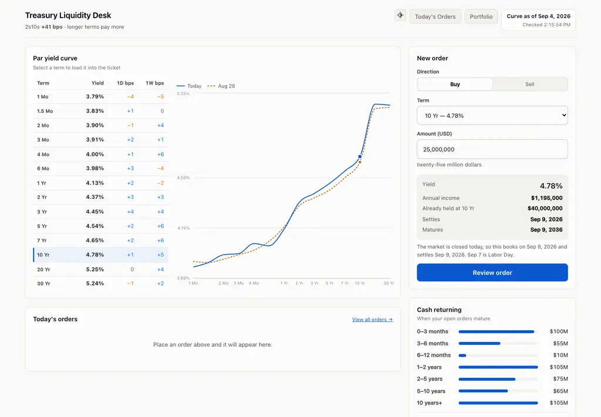
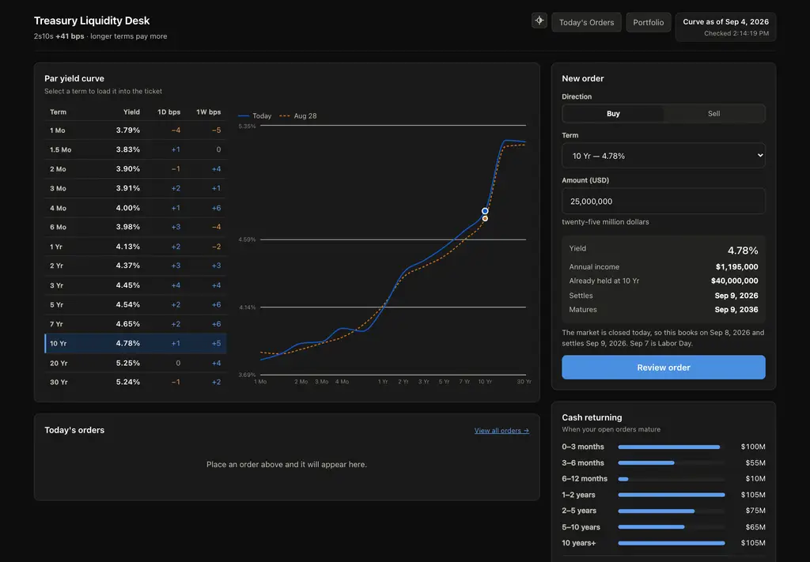

# Treasury Liquidity Desk

A single screen for a bank's liquidity manager: read the curve, pick a term,
place an order, leave. It pulls the U.S. Treasury par yield curve, shows it as a
table with the moves since yesterday and last week, takes an order, and keeps
an order history.

<table><tr>
<td></td>
<td></td>
</tr></table>

<sub>Curve, ticket, and maturity ladder are live; the ladder above reflects the demo orders `setup.sh` seeds (see [Demo data](#demo-data)).</sub>

---

## Running it

**Requirements:** Node.js 20 or newer (developed on 22). Nothing else — no
database server, no API key, no Docker.

```bash
git clone <this-repo> && cd treasury-liquidity && ./setup.sh
```

`setup.sh` checks the Node version, runs `npm install` for both workspaces
(server + web), and seeds a year of demo orders — see [Demo data](#demo-data)
below. Then:

```bash
npm run dev
```

Then open **http://localhost:5173**.

`npm run dev` starts the API on port 4000 and Vite on 5173, which proxies `/api`
to the backend so everything is on one origin.

### Demo data

`setup.sh`'s last step is `npm run seed` (`server/scripts/seed.ts`), which
populates the order history, maturity ladder, and portfolio table with a realistic
year of orders instead of leaving them empty on first run:

1. **Pulls the curve first if needed.** The seed script fetches from Treasury
   itself before seeding — nothing else has to be running. This is also what
   pulls the two years of curve history (`yearsToLoad()` in `curves.ts`)
   that the seeded dates are drawn from.
2. **Only ever uses real published dates.** It reads the actual distinct
   `as_of_date` values already in the database rather than hardcoding
   calendar dates, so it produces a sane result no matter what day you run
   it — never a weekend or holiday Treasury didn't publish.
3. **Spreads ~24 orders across the last year**, sampled roughly every two
   weeks from oldest to newest, mixing tenors (3M through 30Y) and amounts.
   Two of them are SELLs — but only once a tenor has been bought at least
   twice already, so the seeded book never shows a negative position.
4. **Yields are the real ones from that day's curve**, looked up per order —
   the same mark-to-market math the app runs on real orders, so it shows
   realistic accrued interest and unrealized P&L (which can be negative:
   that's correct bond math when rates moved against the position since
   purchase, not a bug).
5. **Safe to re-run, never fails setup.** It skips seeding entirely if any
   `seed-*` order already exists, and if Treasury's feed is unreachable it
   warns and leaves the ledger empty rather than failing the install — an
   empty demo is better than a broken one.

Skip it, or start over: delete `data/desk.db` (and `-shm`/`-wal` alongside
it) and re-run `npm run seed`, or just don't run it — `npm install && npm run
dev` alone leaves the ledger genuinely empty.

### Production-style run (one process, one port)

```bash
npm install
npm run build
npm start          # http://localhost:4000
```

### Tests

```bash
npm test
```

60 tests: the Treasury XML parser, integer money and rate arithmetic, the
settlement calendar validated against three years of real publication data, the
booking-window/cutoff logic, maturity-ladder bucket assignment, and order
cancellation eligibility.

---

## Data source

[U.S. Department of the Treasury — Daily Par Yield Curve Rates](https://home.treasury.gov/resource-center/data-chart-center/interest-rates/TextView?type=daily_treasury_yield_curve),
read from the public XML feed. No key or registration required.

**Freshness.** The server holds the current year for 1 minute; the page
re-polls every minute while visible and on tab focus. A newly published curve
reaches the screen within about two minutes worst case. There is no refresh
button — keeping current is the app's job. A retry control appears only when the
app could not update itself.

---

## Architecture

```
treasury-liquidity/
├── server/                     Express + TypeScript API (port 4000)
│   ├── src/lib/units.ts        integer basis points and minor units
│   ├── src/lib/treasury.ts     feed client: fetch and parse to bps
│   ├── src/lib/curveStore.ts   curve persistence, upsert-on-conflict
│   ├── src/lib/curves.ts       refresh, deltas, spread, staleness
│   ├── src/lib/calendar.ts     federal holidays, T+1, desk cutoff
│   ├── src/lib/quote.ts        the one place order economics are computed
│   ├── src/lib/orders.ts       append-only orders and event log
│   ├── src/lib/database.ts     schema
│   └── src/routes/             HTTP layer only — no business logic
└── web/                        React + Vite + TypeScript (port 5173)
    ├── src/components/         header, curve table, ticket, order history
    └── src/lib/                API client, formatting, chart palette
```

**Storage.** SQLite via `better-sqlite3`, at `data/desk.db` (created on first
run, gitignored). Set `DB_PATH` to move it.

### API

| Method | Route | Purpose |
|---|---|---|
| `GET` | `/api/curve` | Current curve, per-tenor 1D/1W deltas, 2s10s, freshness |
| `GET` | `/api/curve/tenors` | Tradable term list |
| `POST` | `/api/curve/refresh` | Force a pull, bypassing the TTL |
| `GET` | `/api/orders?scope=today\|all` | Order history |
| `GET` | `/api/orders/ladder` | Open notional bucketed by maturity |
| `GET` | `/api/orders/preview` | Economics the desk would book right now |
| `GET` | `/api/orders/:id/events` | The append-only history behind an order |
| `POST` | `/api/orders` | Place an order |
| `POST` | `/api/orders/:id/cancel` | Withdraw an order before it settles |

```bash
curl -X POST http://localhost:4000/api/orders \
  -H 'Content-Type: application/json' \
  -d '{"idempotencyKey":"'"$(uuidgen)"'","side":"BUY","tenorKey":"10Y",
       "amountMinor":2500000000,"expectedYieldBps":478}'
```

### Configuration

| Variable | Default | Meaning |
|---|---|---|
| `PORT` | `4000` | API port |
| `DB_PATH` | `../data/desk.db` | SQLite location |
| `DESK_TIMEZONE` | `America/New_York` | Timezone the cutoff is expressed in |
| `CUTOFF_HOUR` / `CUTOFF_MINUTE` | `15` / `0` | Daily cutoff |
| `LARGE_ORDER_MULTIPLE` | `3` | Flag tickets above this × the running median |

